# Audio-Driven Hate Speech Detection in Telugu

**A comprehensive framework for detecting hate speech in the low-resource Telugu language using multimodal (audio and text) analysis.**

[](https://opensource.org/licenses/MIT)
[](https://www.python.org/downloads/release/python-380/)

---

## 📜 Abstract

The rapid integration of social media into our daily lives has introduced significant challenges in ensuring user safety, particularly due to the spread of hate speech. While hate speech detection has seen advances in high-resource languages like English, low-resource languages such as Telugu are critically underserved, lacking the necessary annotated datasets and tools for effective content moderation. This project addresses this crucial gap by introducing a complete, manually annotated multimodal hate speech dataset for the Telugu language, comprising two hours of audio-text pairs sourced from YouTube. We conduct a systematic evaluation of both speech and text modalities for hate speech detection, employing a range of classical machine learning and state-of-the-art transformer-based models. Our findings demonstrate that an OpenSMILE feature set combined with an SVM classifier achieves the highest performance for audio-based binary classification (91% accuracy, 0.89 F1-score), while the LaBSE model excels for text-based classification (89% accuracy). This work not only provides a valuable new dataset for the research community but also establishes strong baseline models, highlighting the significance of acoustic cues in detecting hate speech, especially when textual content is ambiguous or transliterated.

## 🎯 The Problem Statement

Online platforms are struggling with the proliferation of hateful content, which poses a direct threat to human safety and psychological well-being. The core of the problem is twofold:

1.  **The Low-Resource Language Gap**: Most content moderation systems are designed for English, leaving speakers of other languages, like the ~83 million Telugu speakers, vulnerable.
2.  **The Modality Gap**: Hate speech detection has traditionally focused on text, ignoring crucial vocal cues like **tone, prosody, and aggression** present in audio and video content. Sarcastic or implicit hate, which is difficult to capture from text alone, can often be identified through these acoustic features.

This project tackles these challenges by developing a robust framework specifically for **audio-driven** hate speech detection in Telugu, supported by an ablation study on text to understand the contributions of each modality.

## ✨ Key Contributions

*   **Novel Multimodal Dataset**: Creation of the first manually annotated, 2-hour audio-text hate speech dataset for the Telugu language, sourced from real-world YouTube content.
*   **Audio-Centric Analysis**: A deep dive into audio-based hate speech detection using both traditional acoustic features (OpenSMILE, LIBROSA) and modern deep learning representations (Wav2Vec2, AST).
*   **Comprehensive Benchmarking**: Systematic evaluation and comparison of various models for both audio and text modalities, establishing strong baselines for future research in low-resource languages.
*   **Open Source**: The dataset and models serve as a foundation for further research in multimodal and low-resource NLP.

## 🔧 Methodology & Pipeline

Our methodology follows a structured pipeline from data collection to model evaluation. The dataset was split into 480 training samples and 121 testing samples. We engineered separate feature extraction and classification tracks for each modality to systematically evaluate their individual performance.

```mermaid
graph TD
    A[📽️ YouTube Video Identification] --> B(📥 Video Download);
    B --> C(🎵 Audio Extraction);
    C --> D{Trim Hate/Non-Hate Segments};
    D --> E[💬 Transcription Generation];
    D --> F[🎤 Speech Data];
    E --> G[📝 Text Data];

    subgraph Dataset Preparation
        A; B; C; D; E;
    end

    subgraph Speech Modality Processing
        F --> F_Feat(Feature Extraction <br> OpenSMILE, Wav2Vec2, AST, etc.);
        F_Feat --> F_Train(Model Training <br> SVM, LSTM, CNN);
    end

    subgraph Text Modality Processing
        G --> G_Feat(Feature Extraction <br> TF-IDF, mBERT, LaBSE, etc.);
        G_Feat --> G_Train(Model Training <br> SVM, XGBoost, Transformers);
    end

    subgraph Evaluation
        F_Train --> Result(📊 Binary & Multi-Class Classification);
        G_Train --> Result;
    end

    style Dataset Preparation fill:#f9f,stroke:#333,stroke-width:2px
    style 'Speech Modality Processing' fill:#ccf,stroke:#333,stroke-width:2px
    style 'Text Modality Processing' fill:#cfc,stroke:#333,stroke-width:2px
    style Evaluation fill:#ffc,stroke:#333,stroke-width:2px
```



## 📊 The Dataset

The dataset was created as part of the **DravLangGuard** initiative and is meticulously annotated for hate speech.

### Data Collection & Annotation

*   **Source**: Audio clips were gathered from YouTube channels with over 50,000 subscribers to ensure realistic, in-the-wild data.
*   **Annotation**: Three native Telugu speakers with postgraduate degrees performed the annotation. They first classified content into **Hate** and **Non-Hate**. The hate speech was further categorized into four subclasses based on YouTube's hate speech policy.
*   **Reliability**: The inter-annotator agreement was measured at **~0.79 using Cohen's Kappa**, indicating a high degree of reliability.

### Dataset Statistics

The dataset is balanced between hate and non-hate content, with a detailed breakdown of hate speech categories.

| Class | Sub-Class | Short Label | No. of Samples | Total Duration (min) |
| :---- | :-------------------- | :---------: | :------------: | :------------------: |
| **Hate (H)** | Gender | G | 111 | 15.75 |
| | Religion | R | 82 | 15.49 |
| | Political / Nationality | P | 68 | 14.90 |
| | Personal Defamation | C | 133 | 14.90 |
| **Non-Hate (NH)**| Non-Hate | N | 208 | 60.00 |

## 🧠 Models & Experiments

We explored a wide array of feature extraction techniques and classification models to identify the most effective approaches for each modality.

### 🎤 Audio Modality

*   **Acoustic Features**:
    *   **OpenSMILE**: Extracted 150 statistical features (e.g., MFCC, RMS Energy, Zero-Crossing Rate) using the ComParE 2016 configuration.
    *   **Librosa**: Generated feature sets from mel spectrograms, MFCCs, and chromagrams.
*   **Deep Learning Representations**:
    *   **Wav2Vec2 (XSLR)**: Self-supervised model for generating contextualized voice embeddings.
    *   **Indic-Wav2Vec2**: A Wav2Vec2 model specifically pre-trained on Indic languages.
    *   **Audio Spectrogram Transformer (AST)**: A transformer-based model that processes spectrogram representations directly.

### 📝 Text Modality (Ablation Study)

*   **Lexical Features**:
    *   **TF-IDF**: A baseline to represent word importance statistically.
*   **Transformer-Based Embeddings**:
    *   **mBERT**: A multilingual BERT model fine-tuned on our Telugu text.
    *   **XLM-RoBERTa**: A powerful cross-lingual model known for its generalization capabilities.
    *   **LaBSE (Language-agnostic BERT Sentence Embedding)**: A model that generates sentence-level embeddings optimized for semantic similarity.

## 📈 Results

Our experiments yielded insightful results, highlighting the strengths of different models in binary (Hate vs. Non-Hate) and multi-class classification tasks.

### Speech-Based Model Performance

| S.No | Model | Classifier | Binary Accuracy | Multi-class Accuracy |
| :--: | :----------------- | :--------------: | :-------------: | :------------------: |
| 1 | **OpenSmile** | **SVM** | **91%** | 79% |
| | | Gradient Boost | 82% | **84%** |
| 2 | Wav2Vec2 - XLSR | LSTM | 84% | 68% |
| | | CNN | 84% | 66% |
| 3 | Indic Wav2Vec2 | - | 90% | 68% |
| 4 | AST | - | 86% | 81% |
| 5 | Librosa Feature Set | - | 88% | 61% |

### Text-Based Model Performance

| S.No | Model | Classifier | Binary Accuracy | Multi-class Accuracy |
| :--: | :----------------- | :--------------: | :-------------: | :------------------: |
| 1 | TF-IDF | SVM | 78% | 55% |
| | | Random Forest | 78% | 48% |
| 2 | mBERT | XG Boost | 79% | 64% |
| 3 | mBERT | - | 83% | 71% |
| 4 | XLM-RoBERTa | - | 84% | **80%** |
| 5 | **LaBSE** | - | **89%** | 76% |

## 💡 Key Insights & Learnings

*   **Audio is a Powerful Signal**: For binary classification, the traditional acoustic features from **OpenSMILE paired with an SVM classifier outperformed all other models**, including complex deep learning approaches. This suggests that statistical functionals of acoustic properties are highly effective at capturing the hateful nature of speech.
*   **Transformers Excel in Text**: Sentence-level transformer models like **LaBSE and XLM-RoBERTa** showed superior performance on the text data, confirming the power of contextual embeddings for semantic understanding.
*   **Complementary Strengths**: While audio-based models showed slightly better robustness for binary detection, text-based models (specifically XLM-R) generalized better to the multi-class problem. This highlights that a truly robust system would benefit from **multimodal fusion**.
*   **Deep Learning for Generalization**: Transformer-based audio models like AST showed a more balanced performance between binary and multi-class tasks, indicating better generalization across different hate speech categories compared to traditional methods.

## 🚀 Real-World Impact & Future Directions

This project serves as a critical first step towards creating safer online spaces for low-resource language communities.

**Impact**:
*   Can be integrated into content moderation pipelines for social media platforms, especially for video and audio content.
*   Provides a foundation for building more ethical and secure Cyber-Physical Systems (CPS) where human interaction is paramount.

**Future Work**:
1.  **Dataset Expansion**: The current dataset, while valuable, is limited to two hours. Expanding it with more data, speaker diversity, and dialects will enhance model generalizability.
2.  **Multimodal Fusion**: The next logical step is to investigate advanced fusion techniques (e.g., joint embeddings, co-attention mechanisms) that combine audio and text features to build a model that is more robust than the sum of its parts.
3.  **Cross-Lingual Transfer**: Explore transfer learning from high-resource languages to further improve model performance on Telugu.

## 🙏 Citation

If you use this dataset or code in your research, please cite the original paper:

```bibtex
@inproceedings{kumar2024audio,
  title={Audio Driven Detection of Hate Speech in Telugu: Toward Ethical and Secure CPS},
  author={Kumar M, Santhosh and Ravula P, Sai and Teja M, Prasanna and Surya J, Ajay and V, Mohitha and Lal G, Jyothish},
  year={2024}
}
```
